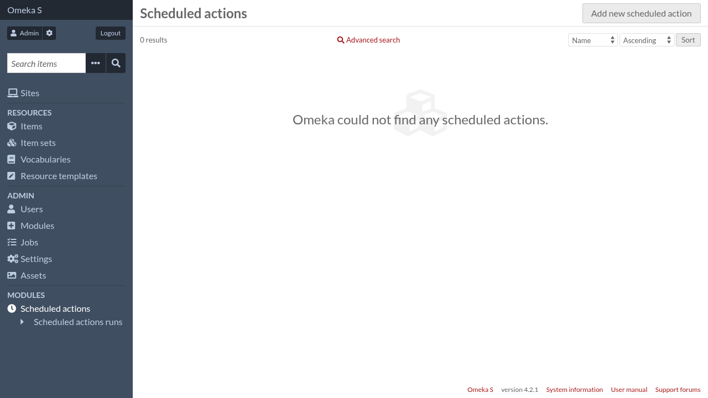
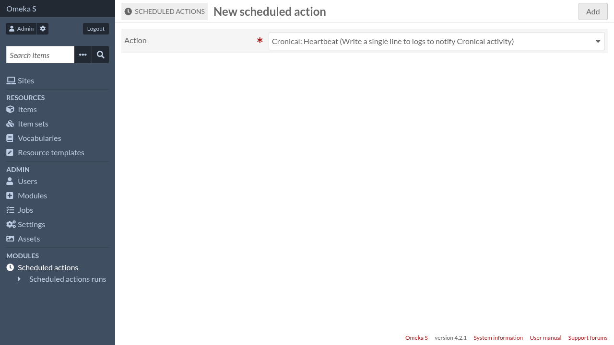
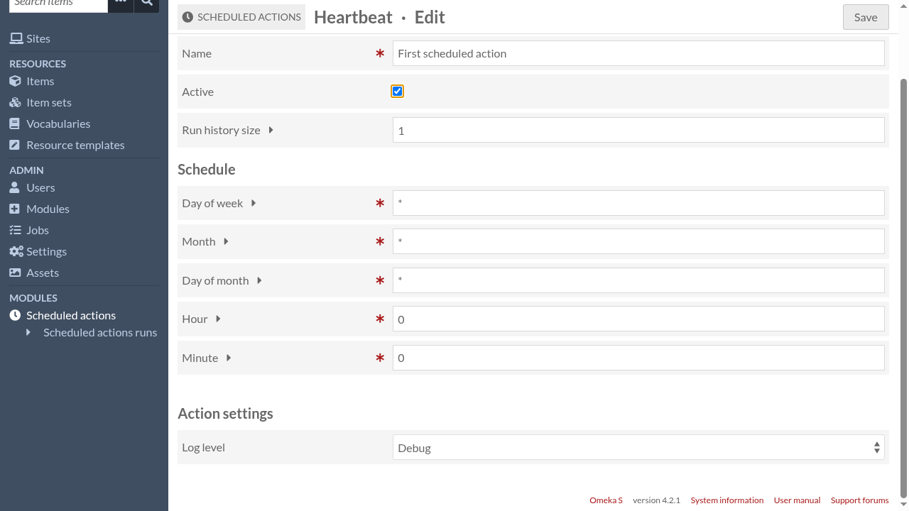
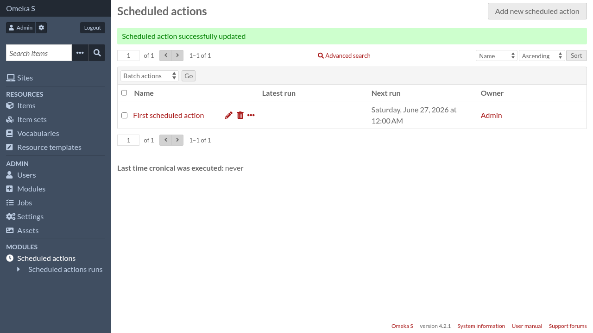

Scheduled actions
=================

To manage scheduled actions, go to Omeka S administration interface and click
on "Scheduled actions" in the navigation menu.

Click on "Add new scheduled action"

Choose an action then click on the "Add" button.

Cronical provides a few :doc:`built-in actions <builtin-actions>`. Other
enabled modules can provide more actions.

Scheduled actions have the following parameters:

Name
    A descriptive name of this particular scheduled action (the same action can
    be scheduled more than once).

Active
    Only active scheduled actions are run, so you can use this parameter
    to temporarily disable a scheduled action.

Run history size
    Every time a scheduled action is run, Cronical keep some information about
    this execution (or "run"), like the time it started or its status.

    To avoid an evergrowing database table of old runs, Cronical only keep the
    most recent runs and delete the others. This parameter allows you to
    configure how many runs you want to keep for that scheduled action.

The next section allows to configure when the action will be run. It should be
familiar to those that are used to configure ``cron`` but there are some differences.

Day of week
    The day of week during which the action will be run. Can be any valid cron
    expression, for instance:

    - ``0`` means Sunday
    - ``1-5`` means from Monday to Friday
    - ``*/2`` means Sunday, Tuesday, Thursday and Saturday
    - ``0,6`` means Sunday and Saturday

Month
    The month during which the action will be run. Can be any valid cron
    expression, for instance:

    - ``1`` means January
    - ``2-6`` means from February to June
    - ``*/2`` means January, March, May, July, September and November
    - ``3,6,9`` means March, June and September

Day of month
    The day of month during which the action will be run. Can be any valid cron
    expression, for instance:

    - ``1`` means the 1st day of the month
    - ``1-10`` means from the 1st to the 10th day of the month
    - ``*/5`` means the 1st, 6th, 11th, 16th, 21st, 26th and (if it exists) the 31st day of the month
    - ``1,11,21`` means the 1st, 11th and 21st day of the month

Hour
    The hour at which the action will be run. Unlike the other parameters, only
    a single number is allowed here.

Minute
    The minute at which the action will be run. Unlike the other parameters,
    only a single number is allowed here.

Finally, if the action itself declares more parameters, they will be configurable there too.

When you are done, click on the "Save" button.

Scheduled action owner
----------------------

Scheduled actions are owned by the user who created it. When an action is run,
it acts as if the owner was authenticated. So for instance, if an action
creates an item without specifying an explicit owner, the action's owner will
be the owner of the new item.

Currently it's not possible to change the owner of a scheduled action.

System scheduled actions
------------------------

System admistrators have the ability to add special scheduled actions, called
system scheduled actions. These scheduled actions appear in the Omeka S
administration interface but they cannot be modified nor deleted.

System scheduled actions can be added using the script ``bin/schedule-add``. A typical usage would be::

    bin/schedule-add \
        --owner-id 1 \
        --action "Cronical\\Action\\Heartbeat" \
        --cron-expression "0 0 * * *" \
        --system \
        --name "Heartbeat (system)" \
        --settings '{"log_level": 4}'

Scheduled actions added by this script are immediately active.

Run ``bin/schedule-add --help`` for more documentation.

``bin/schedule-add`` have the ability to bypass the limitation on hour and
minute schedule, so it can be used to schedule an action every minute (for
instance). It can also be used to add non-system scheduled actions.
